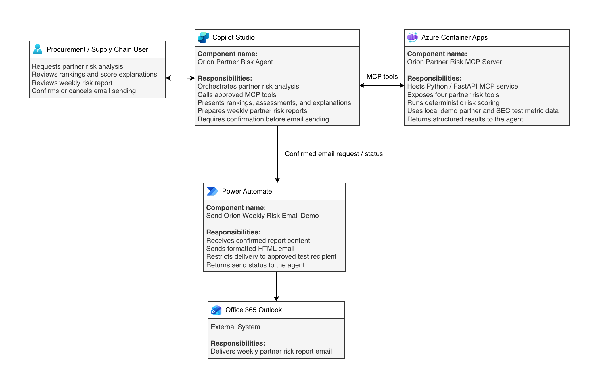

# Partner Risk Intelligence Agent

A Copilot Studio agent for partner and supplier risk analysis, backed by an Azure-hosted Python MCP server.

The solution supports partner risk ranking, individual assessments, score explanations, weekly risk reporting, and controlled Outlook email delivery.

## Architecture



The demonstrated runtime consists of:

- **Copilot Studio** — Orion Partner Risk Agent
- **Azure Container Apps** — Python / FastAPI MCP server
- **Power Automate** — confirmed weekly report email flow
- **Office 365 Outlook** — email delivery

The MCP server exposes four tools:

- `assess_partner`
- `rank_partners`
- `explain_partner_score`
- `generate_weekly_report`

## Risk Scoring

Partner risk is calculated using deterministic weighted logic based on:

- financial-health indicators
- annual spend / exposure
- business criticality
- single-source dependency
- SEC coverage completeness

The scoring logic is implemented in `app/scoring.py`.

## Email Safety

Weekly reports are only sent after explicit user confirmation.

The Power Automate flow is restricted to a configured approved test recipient rather than accepting arbitrary recipient addresses from chat.

## Demo Scope

The deployed MCP demo uses a controlled local partner dataset and SEC test metrics.

Dataverse tables for **Partner**, **Risk Snapshot**, and **Weekly Report** were created as part of the wider solution design, and live SEC API integration was explored separately, but neither is an active dependency of the demonstrated MCP runtime.

## Run Locally

Install dependencies:

```bash
pip install -r requirements.txt
